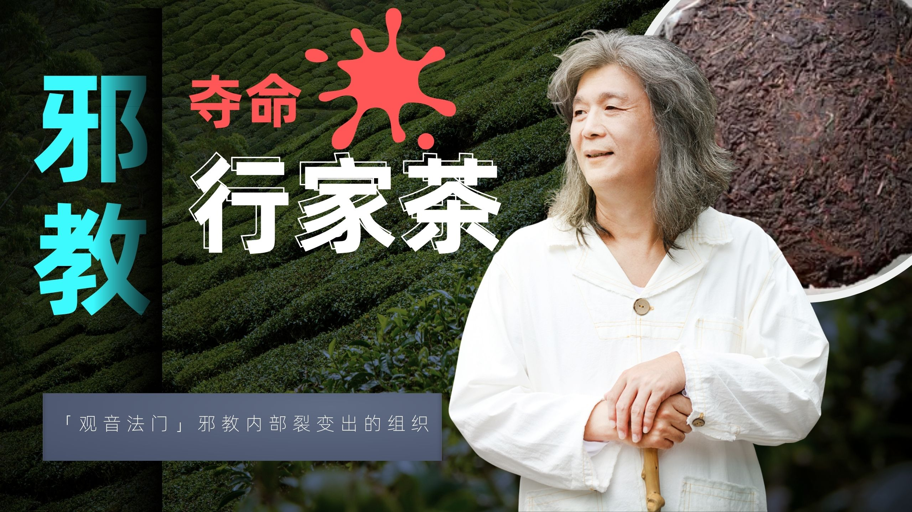

# 反邪教行动 - 行家茶道
**行家茶道研究会**（简称“**行家茶**”）是台湾人**何在彬**于2004年在中国台湾地区建立的一个组织。该组织以“以茶入道，提升性灵，增进人类和平，共创人间天堂”为宗旨。通过“茶会”等活动蛊惑人心，并以几千至数万元不等的高价在各地大肆兜售所谓“古树茶”、“年份茶”以及茶器。

相关网站：

- [行家茶道研究会](http://hangjia.com.tw)
- [百年万鸿记](http://www.jwhtea.com)
